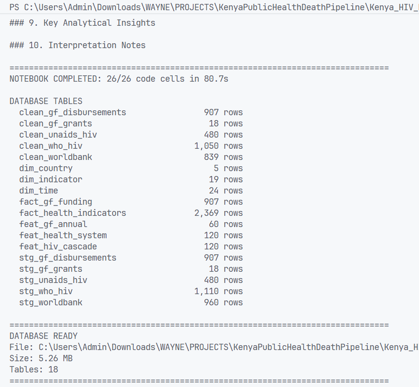

# Kenya Public Health Data Pipeline
## Case Study: HIV Treatment Cascade & Health Systems Analytics
*Author: Wayne Willis Omondi*
---

## Executive Summary

Kenya has an estimated 1.4 to 1.6 million people living with HIV, one of the highest country totals in sub-Saharan Africa. It also has one of the more documented ART scale-up trajectories on the continent. Coverage went from below 10% in 2005 to above 80% by the early 2020s. AIDS-related deaths fell substantially in that period, and PEPFAR and the Global Fund have both used Kenya as a programming reference across East Africa.

The national numbers conceal real gaps. Over 200,000 people living with HIV are not on ART. County-level coverage is uneven enough that the national average hides rates below 50% in some northern counties. The health workforce sits below the WHO minimum of 4.45 per 1,000. Global Fund HIV disbursements to Kenya peaked in the 2015-2019 grant cycle and have not grown since, which puts pressure on domestic financing commitments under Kenya's UHC rollout.

This pipeline pulls live data from four public health data systems (WHO GHO, World Bank, UNAIDS AIDSInfo, and the Global Fund Data Service), stages it in DuckDB, builds HIV cascade and health system features, and produces charts and SQL-queryable tables for programme reviews, donor reporting, and strategic planning.

---

## Business Problem

Kenya's national HIV programme runs across five separate reporting systems: NASCOP, KHIS2, DATIM, PEPFAR MER, and the NACC. None of them produce cross-source views on their own. A programme officer wanting to compare Kenya's ART coverage trajectory against regional peers while checking whether Global Fund investment correlates with those gains has to pull from multiple portals, join spreadsheets by hand, and start again at the next review cycle.

This comes up at quarterly PEPFAR reviews, KASF II annual assessments, and NSDCC target-setting exercises. The same analysis gets rebuilt with updated data each time.

Three gaps drove this design.

**No single indicator view across sources.** WHO GHO, World Bank, and IHME each produce HIV estimates that partly overlap but differ in method and coverage year. Analysts usually pick one source and treat it as authoritative, which means the divergence between estimates goes unexamined. A staging layer with explicit source tagging makes the comparison visible rather than assumed away.

**No financing-to-outcomes linkage.** Global Fund disbursement data sits in the Fund's own portal. Health outcome trends sit in WHO and the World Bank. Joining them to ask whether higher investment years correlate with faster ART gains requires a cross-system extract that most programme teams have not built.

**No reproducible pipeline.** Spreadsheet analyses cannot be rerun, version-controlled, or handed off intact. Any update to source data means rebuilding from scratch. A code-based ELT pipeline with a persistent DuckDB file means quarterly reviews can pull updated numbers without starting over.

---

## Project purpose

The pipeline brings together HIV burden, treatment coverage, health financing, workforce capacity, demography and external programme financing. It supports questions such as:

- How has Kenya's HIV treatment cascade changed since 2000?
- How does Kenya compare with selected East African countries?
- How have HIV incidence and estimated burden changed across programme eras?
- How do health expenditure and workforce capacity relate to treatment coverage?
- How much has the Global Fund disbursed to Kenya by year and component?
- How do WHO and UNAIDS estimates differ for related measures?

The analysis is descriptive and exploratory. Correlations and programme-era overlays are not causal estimates.

---

## Objectives

1. Pull HIV burden, health system capacity, and financing data from four public APIs into a single DuckDB database with no manual download steps, and make the pipeline fully reproducible on rerun.

2. Build a Kenya HIV treatment cascade with derived features (treatment gap, year-on-year ART coverage change, AIDS case-fatality proxy, 95-95-95 progress proxies) that align with UNAIDS and NASCOP reporting frameworks.

3. Pull comparable data for Uganda, Tanzania, Ethiopia, and Rwanda alongside Kenya so regional comparisons sit in the same database rather than separate analyses.

4. Join Global Fund disbursement history to WHO and World Bank outcome trends in a unified fact model, making investment-efficiency questions answerable in SQL.

5. Write a persistent `.duckdb` file with a documented star schema that other analysts or BI tools can query without rerunning the extraction layer.

6. Document every data source with its exact endpoint URL so any figure in the output can be traced to a primary source.

---

## Data Sources

All four sources are publicly accessible without authentication.

### 1 · WHO Global Health Observatory (GHO) OData API

| Field | Detail |
|-------|--------|
| **Base URL** | `https://ghoapi.azureedge.net/api/` |
| **Protocol** | OData v4 REST — filter with `$filter=SpatialDim eq 'KEN'` |
| **Auth** | None |
| **Format** | JSON |
| **Documentation** | https://www.who.int/data/gho/info/gho-odata-api |

**Indicators pulled:**

| Code | Description | Example URL |
|------|-------------|-------------|
| `HIV_0000000001` | People living with HIV, all ages (estimate with CI) | `https://ghoapi.azureedge.net/api/HIV_0000000001?$filter=SpatialDim eq 'KEN'` |
| `HIV_0000000006` | HIV prevalence %, adults 15–49 | `https://ghoapi.azureedge.net/api/HIV_0000000006?$filter=SpatialDim eq 'KEN'` |
| `HIV_0000000007` | Reported number on ART | `https://ghoapi.azureedge.net/api/HIV_0000000007?$filter=SpatialDim eq 'KEN'` |
| `HIV_0000000011` | ART coverage % among PLHIV | `https://ghoapi.azureedge.net/api/HIV_0000000011?$filter=SpatialDim eq 'KEN'` |
| `HIV_0000000024` | New HIV infections per year (estimate) | `https://ghoapi.azureedge.net/api/HIV_0000000024?$filter=SpatialDim eq 'KEN'` |
| `HIV_0000000026` | AIDS-related deaths per year (estimate) | `https://ghoapi.azureedge.net/api/HIV_0000000026?$filter=SpatialDim eq 'KEN'` |
| `WHOSIS_000001` | Life expectancy at birth | `https://ghoapi.azureedge.net/api/WHOSIS_000001?$filter=SpatialDim eq 'KEN'` |

Countries: KEN, UGA, TZA, ETH, RWA (East Africa). Indicator catalogue: `https://ghoapi.azureedge.net/api/Indicator`

---

### 2 · World Bank Open Data API

| Field | Detail |
|-------|--------|
| **Base URL** | `https://api.worldbank.org/v2/` |
| **Protocol** | JSON REST, paginated (`per_page`, `page` params) |
| **Auth** | None |
| **Format** | JSON (`format=json`) |
| **Documentation** | https://datahelpdesk.worldbank.org/knowledgebase/articles/889392 |

**Indicators pulled:**

| Indicator ID | Description | Example URL |
|--------------|-------------|-------------|
| `SH.HIV.INCD.ZS` | HIV incidence (per 1,000 uninfected, 15–49) | `https://api.worldbank.org/v2/country/KEN/indicator/SH.HIV.INCD.ZS?format=json` |
| `SH.HIV.ARTC.ZS` | ART coverage (% of PLHIV) | `https://api.worldbank.org/v2/country/KEN/indicator/SH.HIV.ARTC.ZS?format=json` |
| `SH.XPD.CHEX.GD.ZS` | Current health expenditure (% of GDP) | `https://api.worldbank.org/v2/country/KEN/indicator/SH.XPD.CHEX.GD.ZS?format=json` |
| `SH.XPD.CHEX.PC.CD` | Health expenditure per capita (USD) | `https://api.worldbank.org/v2/country/KEN/indicator/SH.XPD.CHEX.PC.CD?format=json` |
| `SH.MED.NUMW.P3` | Nurses and midwives per 1,000 | `https://api.worldbank.org/v2/country/KEN/indicator/SH.MED.NUMW.P3?format=json` |
| `SH.MED.PHYS.ZS` | Physicians per 1,000 | `https://api.worldbank.org/v2/country/KEN/indicator/SH.MED.PHYS.ZS?format=json` |
| `SP.POP.TOTL` | Total population | `https://api.worldbank.org/v2/country/KEN/indicator/SP.POP.TOTL?format=json` |
| `NY.GDP.PCAP.CD` | GDP per capita, current USD | `https://api.worldbank.org/v2/country/KEN/indicator/NY.GDP.PCAP.CD?format=json` |

Multi-country calls use `;`-separated ISO3 codes: `KEN;UGA;TZA;ETH;RWA`

---

### 3 · UNAIDS AIDSInfo Estimates 2026

| Field | Detail |
|-------|--------|
| **URL** | `https://aidsinfo.unaids.org/public/documents/Estimates_2026_en.zip` |
| **Auth** | None |
| **Format** | ZIP containing Excel workbook(s) — wide format, countries as rows, years as columns |
| **Data portal** | https://aidsinfo.unaids.org/ |

> **Note on the previous source:** The OWID per-chart CSV API (`ourworldindata.org/grapher/`) returns 403 Forbidden in automated requests. The legacy `owid/owid-datasets` GitHub repository was also deprecated (404). So I found the UNAIDS AIDSInfo to be the authoritative replacement and a direct improvement: it includes 95-95-95 cascade figures that the OWID/IHME dataset did not cover.

**Indicators extracted:**

| Sheet name (partial match) | Metric label | Notes |
|----------------------------|--------------|-------|
| People living with HIV | `unaids_plhiv` | Point estimate |
| New HIV infections | `unaids_new_infections` | Point estimate |
| AIDS-related deaths | `unaids_aids_deaths` | Point estimate |
| Antiretroviral therapy | `unaids_art_coverage_pct` | % of PLHIV on ART |
| Knowledge of HIV status | `unaids_diagnosed_pct` | First 95 |
| On antiretroviral therapy | `unaids_on_art_pct` | Second 95 (conditional on knowing status) |
| Viral suppression | `unaids_virally_suppressed_pct` | Third 95 |

The pipeline takes point estimates only; lower and upper bounds are present in the Excel but not staged. Sheet names are matched by partial string (case-insensitive), so the parser survives minor naming changes between annual releases. The `fact_unaids_cascade` table computes the 95-95-95 composite (share of PLHIV virally suppressed) from these three cascade columns.

---

### 4 · The Global Fund Data Service OData API

| Field | Detail |
|-------|--------|
| **Base URL** | `https://fetch.theglobalfund.org/v4.2/odata` |
| **Protocol** | OData v4 REST |
| **Auth** | None (public read access) |
| **Format** | JSON (`$format=json`) |
| **Swagger / schema browser** | `https://fetch.theglobalfund.org/swagger` |
| **Data explorer UI** | https://data.theglobalfund.org/ |
| **Note** | v3.3 (`data-service.theglobalfund.org`) was retired 1 December 2024 |

**Endpoints used:**

| Endpoint | Description | Example URL |
|----------|-------------|-------------|
| `VGrantAgreements` | Grant agreements by country, component, recipient, status, budget vs disbursement | `https://fetch.theglobalfund.org/v4.2/odata/VGrantAgreements?$filter=geographicAreaCode_ISO3 eq 'KEN'&$format=json` |
| `VDisbursements` | Actual disbursements by grant, year, and quarter | `https://fetch.theglobalfund.org/v4.2/odata/VDisbursements?$filter=geographicAreaCode_ISO3 eq 'KEN'&$format=json` |

Supports `$filter`, `$select`, `$top`, `$orderby`. The notebook includes a schema probe step that prints live field names before the full pull, which catches any API version changes before they silently break the extraction.

---

## Technology stack

| Technology | Purpose |
|---|---|
| Python | Pipeline orchestration |
| pandas | Source parsing and DataFrame manipulation |
| DuckDB | Analytical storage and SQL transformations |
| NumPy | Numerical operations |
| requests | HTTP extraction |
| Altair | Interactive visualizations |
| zipfile | UNAIDS archive processing |
| ThreadPoolExecutor | Concurrent Global Fund financial extraction |
| Jupyter Notebook | Development and analysis environment |

---

## Why DuckDB

DuckDB runs as a Python library with no server, no connection pool, and no deployment overhead. The whole pipeline runs in the same process as the notebook. For a country-scoped workload pulling from four APIs and writing a few dozen tables, that is just the right level of infrastructure.

The staging layer works the way it does because DuckDB queries pandas DataFrames directly via `SELECT * FROM df`, without a COPY or INSERT step. Raw DataFrames land in memory and DuckDB treats them as tables immediately. The columnar engine runs the cleaning and feature SQL over them faster than pandas `.apply()` chains, and with proper SQL semantics (window functions, CASE, TRY_CAST) that are easier to read and peer-review than chained method calls.

The HIV cascade features rely on `LAG()`, `FIRST_VALUE()`, and cumulative `SUM() OVER (PARTITION BY ... ORDER BY year)`. These are standard SQL in DuckDB. The pandas equivalent requires `.groupby().transform()` with custom lambdas and careful index alignment, which is more code, harder to audit, and easier to get wrong across multi-country partitions.

The pipeline writes to `kenya_health_data.duckdb`. After it runs, every table from raw staging through the model layer is queryable from the DuckDB CLI or any BI tool with a DuckDB connector. A downstream analyst in your team can run `SELECT * FROM feat_hiv_cascade WHERE country_iso3 = 'KEN'` without touching the notebook. In M&E work, where data lineage questions come up at every review, that matters.

The combined record count across all five staging tables is in the low tens of thousands. Running this on BigQuery would be the wrong choice for the actual data volume. DuckDB fits the problem as scoped. It also has room to grow: county-level DHIS2 data for all 47 counties at monthly cadence stays well within what DuckDB handles in-process.

---

## Architecture

### ELT workflow

The project uses an **Extract → Load → Transform** pattern.

Raw extracted DataFrames are staged in DuckDB first.

Cleaning, typing, feature engineering, and analytical modelling are then performed with SQL.

This keeps the ingestion layer separate from the analytical layer.


```
┌──────────────────────────────────────────────────────────────────────┐
│  EXTRACT                                                               │
│  Source 1: WHO GHO API   → df_who_raw   (7 indicators × 5 countries) │
│  Source 2: World Bank API → df_wb_raw   (8 indicators × 5 countries) │
│  Source 3: UNAIDS ZIP    → df_unaids    (95-95-95 cascade estimates)  │
│  Source 4: Global Fund   → df_gf_grants + df_gf_disb                 │
└──────────────────────────────┬───────────────────────────────────────┘
                               │ pandas DataFrames
┌──────────────────────────────▼───────────────────────────────────────┐
│  LOAD (DuckDB Staging)                                                 │
│  stg_who_hiv · stg_worldbank · stg_owid_hiv                           │
│  stg_gf_grants · stg_gf_disbursements                                 │
└──────────────────────────────┬───────────────────────────────────────┘
                               │ SQL CREATE OR REPLACE TABLE
┌──────────────────────────────▼───────────────────────────────────────┐
│  TRANSFORM (DuckDB SQL)                                                │
│                                                                        │
│  Clean layer:                                                          │
│  clean_who_hiv · clean_worldbank · clean_owid_hiv                     │
│  clean_gf_grants · clean_gf_disbursements                             │
│                                                                        │
│  Feature layer (window functions + derived metrics):                  │
│  feat_hiv_cascade · feat_health_system · feat_gf_annual               │
│                                                                        │
│  Model layer (star schema):                                           │
│  dim_country · dim_time · dim_indicator                               │
│  fact_health_indicators · fact_gf_funding                             │
└──────────────────────────────┬───────────────────────────────────────┘
                               │ .fetchdf() → pandas
┌──────────────────────────────▼───────────────────────────────────────┐
│  ANALYTICS & VISUALISATION (Altair)                                    │
│  Chart 1: Kenya HIV Burden — PLHIV, On ART, AIDS Deaths               │
│  Chart 2: East Africa ART Coverage Regional Comparison                 │
│  Chart 3: Kenya HIV Incidence by Programme Era                         │
│  Chart 4: Health Expenditure vs ART Coverage (scatter)                 │
│  Chart 5: Global Fund Kenya Disbursements by Component                 │
└──────────────────────────────────────────────────────────────────────┘
```

---

## DuckDB Table Inventory

| Table | Layer | Description |
|-------|-------|-------------|
| `stg_who_hiv` | Staging | Raw WHO GHO API response |
| `stg_worldbank` | Staging | Raw World Bank API response |
| `stg_unaids` | Staging | UNAIDS AIDSInfo estimates, pivoted to long format |
| `stg_gf_grants` | Staging | Raw Global Fund grant agreements |
| `stg_gf_disbursements` | Staging | Raw Global Fund disbursements |
| `clean_who_hiv` | Clean | Typed, filtered, sex dimension normalised |
| `clean_worldbank` | Clean | Typed, filtered to EA scope |
| `clean_unaids` | Clean | ISO3-mapped, year-filtered, point estimates only |
| `clean_gf_grants` | Clean | Typed dates, disbursement rate computed |
| `clean_gf_disbursements` | Clean | Positive amounts only, year cast |
| `feat_hiv_cascade` | Feature | Pivoted cascade metrics + window-function features |
| `feat_health_system` | Feature | Composite HCW density, investment intensity |
| `feat_gf_annual` | Feature | Annual + cumulative disbursements by component |
| `dim_country` | Model | Country dimension with region and focus flag |
| `dim_time` | Model | Year dimension with policy era and milestone labels |
| `dim_indicator` | Model | Indicator catalogue with source and domain |
| `fact_health_indicators` | Model | Unified WHO GHO + World Bank fact table |
| `fact_gf_funding` | Model | Global Fund disbursements with grant context |
| `fact_unaids_cascade` | Model | UNAIDS 95-95-95 cascade with composite score |

---

## Feature Engineering Reference

### `feat_hiv_cascade`

| Column | Computation |
|--------|-------------|
| `treatment_gap` | `ROUND(plhiv × (1 − art_coverage_pct / 100))` |
| `art_cov_yoy_pp` | `art_coverage_pct − LAG(art_coverage_pct) OVER (PARTITION BY country ORDER BY year)` |
| `infections_yoy_delta` | `new_infections − LAG(new_infections) OVER (...)` |
| `aids_cfr_pct` | `aids_deaths / plhiv × 100` (proxy risk metric) |
| `est_diagnosed_pct_proxy` | `LEAST(art_coverage_pct × 1.08, 100)` — rough 95-95-95 first-95 proxy |

### `feat_health_system`

| Column | Computation |
|--------|-------------|
| `total_hcw_per_1000` | `physicians_per_1000 + nurses_per_1000` (WHO threshold = 4.45) |
| `health_invest_intensity` | `health_exp_per_cap / gdp_per_cap × 1000` |
| `art_cov_delta_since_2010` | `art_coverage_pct − FIRST_VALUE(art_coverage_pct) anchored at 2010` |

---

## Setup & Execution

### Requirements

```
Python >= 3.13
duckdb >= 1.5
pandas >= 2.2
requests >= 2.28
altair >= 6.0
openpyxl
```

### Install

```bash
pip install duckdb pandas requests altair openpyxl
```

### Run

### Option 1: Direct notebook

Open `kenya_health_pipelinev2.ipynb` in JupyterLab, Jupyter Notebook or VS Code and run all cells in sequence. All installs, API calls, DuckDB operations, and visualisations are in the notebook.

### Option 2: Terminal runner

From the terminal, change into the project directory and run:

```bash
python run_kenya_health_pipeline.py
```

The runner executes the notebook in one persistent Jupyter kernel and prints each cell's progress, stream output, text displays, table previews, chart-display notices and the complete Kenya snapshot. It stops at the failing cell if an error occurs. After a successful run it lists every DuckDB table and row count, then prints `DATABASE READY` with the absolute database path.



Optional commands:

```bash
# Save a newly executed notebook copy as well
python run_kenya_health_pipeline.py --save-executed

# Display all command-line options
python run_kenya_health_pipeline.py --help
```

Expected runtime on a standard connection: 3 to 6 minutes, most of it waiting on API responses across 15+ calls.

The DuckDB file `kenya_health_data.duckdb` is written to the working directory and persists between sessions. Rerunning the notebook overwrites all tables cleanly via `CREATE OR REPLACE TABLE`.

### Network requirements

The notebook contacts four external hosts. Ensure outbound HTTPS is open to:
- `ghoapi.azureedge.net`
- `api.worldbank.org`
- `aidsinfo.unaids.org`
- `fetch.theglobalfund.org`

---

## Current Status - Run on 16-9-2026

The revised pipeline was executed end to end on 16 September 2026.

| Check | Result |
|---|---:|
| Code cells executed | 26/26 |
| Saved error outputs | 0 |
| WHO staging rows | 1,110 |
| World Bank staging rows | 960 |
| UNAIDS staging rows | 480 |
| Global Fund grants | 18 |
| Global Fund disbursement transactions | 907 |
| Consolidated health-indicator facts | 2,369 |

Live services can revise their data, so row counts may change on later runs.

### Kenya Summary Snapshot

The analysis query layer produces the following estimates:

| Measure | Value |
|---|---:|
| HIV indicator year | 2023 |
| People living with HIV | 1,500,000 |
| People receiving ART | 1,321,220 |
| ART coverage | 88.0% |
| Coverage-based treatment gap | 180,000 |
| New HIV infections | 18,000 |
| HIV-related deaths | 22,000 |
| Life expectancy | 66.8 years (2021) |
| Annual HIV-related deaths as % of PLHIV | 1.467% |
| ART coverage gain since 2005 | +84.0 percentage points |
| Distance to the 95% benchmark | 7.0 percentage points |
| Global Fund net disbursements, exact HIV component | USD 1,219.5 million |

Life expectancy carries its own year because WHO has no Kenya observation for that series in 2023. The Global Fund total is calculated directly from source transactions and retains negative adjustments.

These numbers describe the executed notebook run. Live WHO, World Bank, and Global Fund values may be revised later.


---

## Scope & Limitations

- **Geography:** National-level aggregates for Kenya and four East African comparators. County-level disaggregation requires authenticated access to Kenya DHIS2/HMIS.
- **Recency:** WHO GHO and World Bank data typically lag 1 to 2 years. Most series run to 2022 or 2023.
- **IHME vs WHO estimates:** IHME GBD mortality estimates are modelled and differ from WHO/UNAIDS surveillance figures. The pipeline includes both; downstream reporting should name the source.
- **Global Fund scope:** Covers Kenya grants only. Regional multi-country grants with a Kenya component may be undercounted.
- **95-95-95 proxy:** The `est_diagnosed_pct_proxy` in `feat_hiv_cascade` is a rough approximation. Authoritative UNAIDS 95-95-95 disaggregated estimates require SPECTRUM model outputs or direct UNAIDS AIDSInfo data.

---

## Key Insights

1. Kenya's ART coverage rose from below 10% in 2005 to above 80% by the early 2020s, the fastest gain in this five-country group.
2. HIV incidence fell across every programme era. The COVID-19 period slowed that decline, and the gap to the UNAIDS 2030 target of 0.1 new infections per 1,000 remains wide.
3. Total HCW per 1,000 (`total_hcw_per_1000`) tracks ART coverage gains more consistently than health expenditure per capita across these five countries. Rwanda's gains correlate with its community health worker deployment, not just spending.
4. Global Fund HIV disbursements for Kenya peaked in the 2015-2019 cycle and have not grown since. The RSSH component share has grown, meaning a larger share of funding is going to health system strengthening rather than direct HIV programming.
5. National ART coverage above 80% sits alongside sub-50% coverage in northern ASAL counties. The national figure does not capture that.

---

## What Next

The pipeline is scoped to what four unauthenticated public APIs can deliver at national level. Each limitation above has a concrete path forward.

### County-level disaggregation via KHIS2

The Kenya Health Information System (KHIS2) holds indicator data at facility, sub-county, and county level via a DHIS2 API at `https://hiskenya.org/api/`. The query pattern is the same as what this pipeline already uses. The blocker is a MOH-issued account. With that access, the pipeline can pull `feat_hiv_cascade` at county level, add a `dim_county` dimension table, and produce ART coverage figures for all 47 counties rather than one national aggregate. That can also unlocks ASAL vs non-ASAL equity comparisons and facility-level retention proxies from the Master Facility List.

### DATIM / PEPFAR MER for reported programme metrics

WHO and World Bank indicators are modelled estimates with 1 to 2 year lags. DATIM holds Kenya's actual PEPFAR MER results: site-level TX_CURR, TX_NEW, HTS_TST, VMMC_CIRC, and PrEP_NEW, reported quarterly. The DATIM API at `https://final.datim.org/api/` is authenticated but accessible to implementing partner staff. Adding it would shift the pipeline from burden estimates to reported performance, and would let it compare PEPFAR-reported numbers directly against WHO estimates, a discrepancy that comes up manually at every programme review.

### UNAIDS AIDSInfo for 95-95-95 cascade data

The `est_diagnosed_pct_proxy` column is a rough approximation. UNAIDS publishes authoritative 95-95-95 cascade data (proportion diagnosed, proportion of diagnosed on ART, proportion virally suppressed) via AIDSInfo at `https://aidsinfo.unaids.org/`. Replacing the proxy with actual UNAIDS disaggregated estimates makes the cascade analysis defensible in donor reporting contexts. PEPFAR POART reviews, KASF II assessments, and COP submissions all reference UNAIDS figures.

### NASCOP commodity data for supply chain coverage

Kenya's ARV supply chain runs through KEMSA and is reported to NASCOP. Integrating commodity data (ARV stock levels, consumption rates, stockout days by facility) adds a supply-side dimension the current pipeline does not have. Stockouts cause viral load rebound and ART interruption. A pipeline that flags counties with high stockout frequency alongside low ART coverage gives supply chain teams a sharper list to work from.

### Scheduled runs and alerting

The pipeline currently runs manually. In a programme operations context, value increases when it runs on a schedule: monthly for WHO and World Bank updates, quarterly when DATIM MER data releases. Prefect or Apache Airflow can orchestrate the existing Python extraction functions as task callables. Alerts can be configured to fire when ART coverage drops more than 2 percentage points quarter-on-quarter, or when a Global Fund disbursement posts without a corresponding outcome update. For shared team access without managing a local file, MotherDuck provides DuckDB's in-process model over a managed connection.

### BI dashboard layer

The `.duckdb` file is directly queryable by Evidence.dev, Metabase (via the DuckDB driver), and Apache Superset. No pipeline changes are needed: `fact_health_indicators`, `feat_hiv_cascade`, and `feat_gf_annual` are already structured for dashboard queries. A dashboard layer means programme managers can pull updated numbers without running the notebook, which removes the analyst-as-bottleneck problem the pipeline is partly designed to solve.

### Predictive modelling

With county-level cascade metrics from DHIS2, the feature tables can serve as training data for short-term forecasts: will Kenya hit the 95-95-95 second-95 target by 2030 at the current county-level rate, when does the treatment gap close at current ART initiation rates, what does incidence look like through 2030 under different PrEP scale-up scenarios. These do not require complex models. A county-level linear trend with scenario bounds is enough for programme planning. The DuckDB feature layer already supports this: add a `scikit-learn` or `statsmodels` step after the analytics queries and write projections to a `proj_*` table in the same database.

---

## Data ethics

The project uses public aggregate health indicators and public programme-financing data.

It does not contain identifiable patient records, personal health information, or confidential clinical data.

---

*Wayne Willis Omondi | Kenya HIV Programme Analytics | DuckDB + pandas ELT | Altair | WHO GHO · World Bank · UNAIDS AIDSInfo · The Global Fund v4.2*
